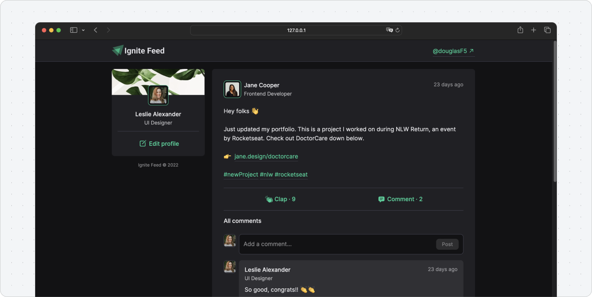
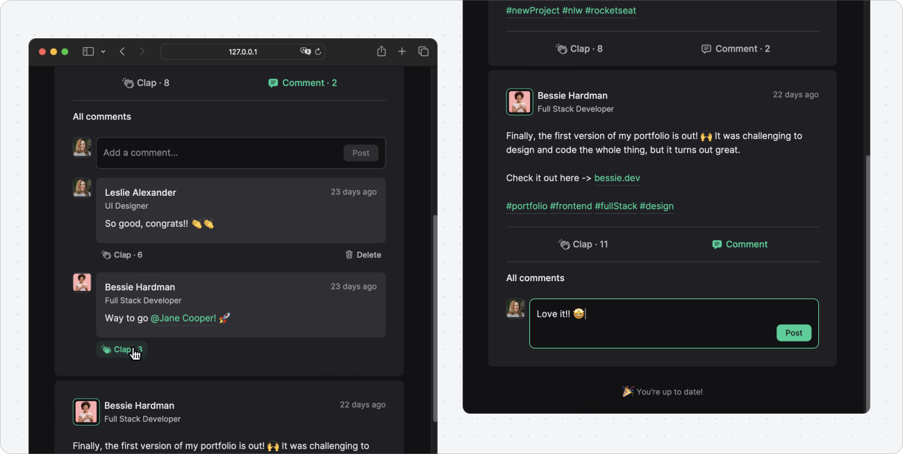

# Ignite Feed

- [About](#about)
  - [Tools](#tools)
  - [Features](#implemented-features)
- [Showcase and examples](#showcase-and-examples)
- [Installing and running](#installing-and-running)
- [Extra notes](#extra-notes)

 

## About

Social media feed UI built with ReactJS.

### Tools used

`Typescript` `ReactJS` `CSS Modules` `Date FNS`

### Implemented features

- ✅ List posts and comments
- ✅ React to posts
- ✅ Add comments
- ✅ Delete comments

 

## Showcase and examples

 

## Installing and running

- After cloning the code repository, use `npm install` to install dependencies, then `npm run dev` to start the application on the development server
- Check out the package.json file for more useful scripts

 

## Extra notes

- This project is purely a practical exercise intended for developing and/or showcasing my skills in the tools/techniques/concepts mentioned above. It's not meant to be a complete production-ready solution. Feel free to reach out if you have any questions or simply want to chat about it!
- This exercise was built following the lessons from [Rocketseat](https://www.rocketseat.com.br/)'s Ignite ReactJS program. It may or may not have been adapted/redesigned by me.
